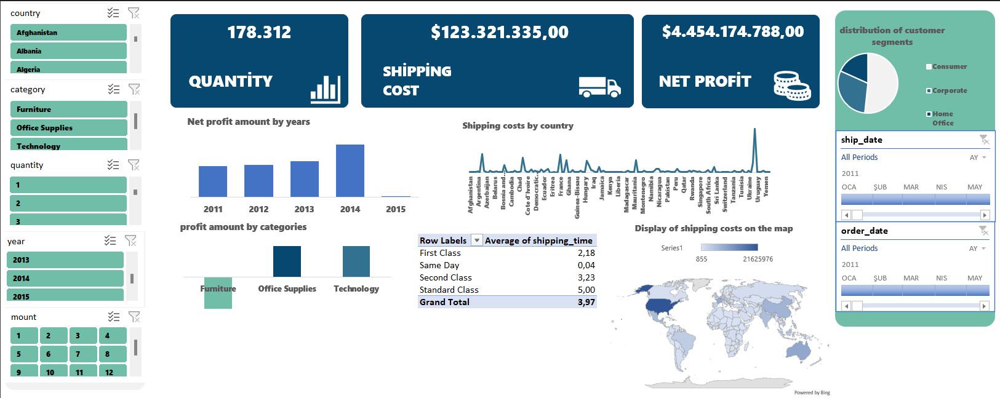

# Business Performance Analysis Dashboard  

## 📌 Overview  
This project focuses on analyzing a company's activities over a specific period. Using Excel, I created a comprehensive dashboard that presents key insights and metrics for business performance evaluation.  

## 🛠️ Project Workflow  
1. **Data Cleaning and Preparation**  
   - Removed unnecessary columns and rows from the dataset.  
   - Filled missing values with appropriate data to ensure accuracy.  

2. **Data Analysis**  
   - Utilized **Pivot Tables**, **Power Query**, and **Excel Formulas** to process and analyze data.  
   - Focused on metrics such as:  
     - Total Sales  
     - Total Profit  
     - Shipping Costs  
     - Customer Types  
     - Profit Margins by Category  
     - Transportation Speeds by Shipping Types  

3. **Dashboard Creation**  
   - Designed an interactive dashboard incorporating tables and visualizations.  
   - Provided a user-friendly layout for easy interpretation of results.  

## 📊 Key Features  
- **Data Visualization**: Graphs and charts to simplify complex data.  
- **Category Analysis**: Profit margins categorized by product types.  
- **Shipping Insights**: Delivery speeds categorized by shipping methods.  
- **Performance Metrics**: Total sales and profit visualizations.  

## 🛠️ Tools Used  
- **Pivot Tables**: For summarizing and analyzing data efficiently.  
- **Power Query**: To clean, transform, and load data.  
- **Excel Formulas**: For complex calculations and manipulations.  
- **Dashboards**: Designed with interactive visual elements like bar charts and pie charts.  

## 💾 File Format  
The dashboard is saved in an Excel workbook (.xlsx) format.  

## Note
The Excel file is large and cannot be previewed directly on GitHub.  
Please download the file to explore the dashboard and analysis.  

Below is a screenshot of the dashboard for reference:  

Feel free to explore and modify the file for further insights!  
